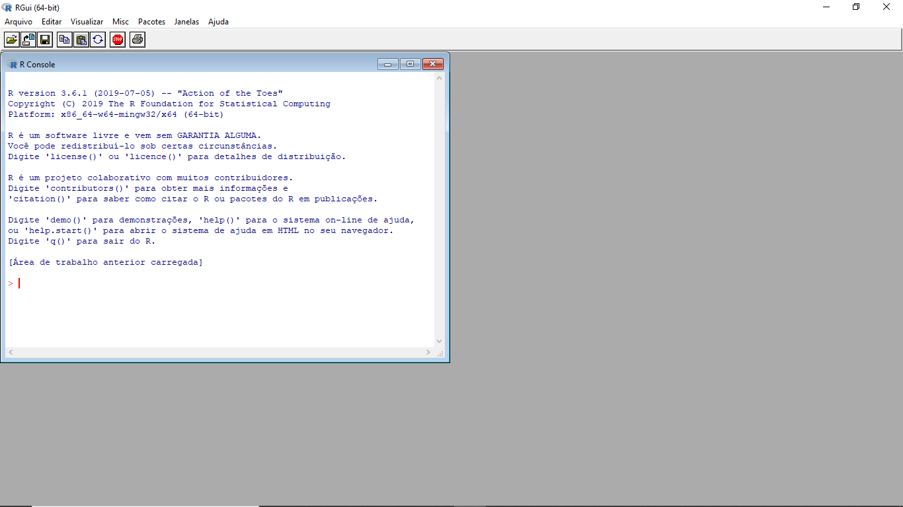

# Introdução {#intro}

> "Existem apenas dois tipos de idiomas: os que as pessoas reclamam e os que ninguém usa". - Bjarne Stroustrup

O modelo típico de análise de dados é similar:

```{r figure1, echo=FALSE, fig.align='center', out.width="75%"}
knitr::include_graphics("imagens/data-science.png")
```

Primeiramente, você deve **importar** seus dados para o R. Significa que você pega os dados armazenados em um arquivo, banco de dados ou API da Web e carrega-os em um data frames no R.

Logo após, a ideia é **organizá**-los. Significa armazená-los de forma consistente.

Depois de arrumar os dados, o próximo passo é **transformá**-los. Significa restringir observações de interesse, criar novas variáveis

Depois de organizar os dados com as variáveis necessárias, existem dois mecanismos principais de geração de conhecimento: visualização e modelagem. Eles têm pontos fortes e fracos complementares, portanto qualquer análise real se repetirá entre eles várias vezes.

A **visualização** é uma atividade fundamentalmente humana. Uma boa visualização mostrará coisas que você não esperava, ou fará novas perguntas sobre os dados.

**Modelos** são ferramentas complementares para visualização. Depois de fazer suas perguntas suficientemente precisas, você pode usar um modelo para respondê-las.

O último passo da ciência de dados é a **comunicação**, uma parte absolutamente crítica de qualquer projeto de análise de dados. Não importa o quão bem seus modelos e visualização levaram você a entender os dados, a menos que você também possa comunicar seus resultados a outras pessoas.

Ao redor de todas essas ferramentas está a programação. A programação é uma ferramenta transversal que você usa em todas as partes do projeto. Você não precisa ser um programador especialista para ser um cientista de dados, mas aprender mais sobre programação compensa, porque se tornar um programador melhor permite automatizar tarefas comuns e resolver novos problemas com maior facilidade.

## Universo `tidyverse`

```{r figure8, echo=FALSE, fig.align='center', out.width="25%"}
knitr::include_graphics("imagens/hex-tidyverse.png")
```

O tidyverse é uma coleção de pacotes R projetados para ciência de dados. Todos os pacotes compartilham uma filosofia de design, gramática e estruturas de dados subjacentes.

Os princípios fundamentais do `tidyverse` são:

  - 1.Reutilizar estruturas de dados existentes;
  - 2.Organizar funções simples usando o pipe;
  - 3.Aderir à programação funcional;
  - 4.Projetado para ser usado por seres humanos.
  
Assim como o processo típico do passo a passo apresentando anteriormente para análise de dados, o `tidyverse` é a ferramenta que o ajuda eficientemente a executar este processo.

```{r}
library(tidyverse) #Carregar o pacote.
tidyverse_logo() #Logo
```

## Tibbles


## R e RStudio

A primeira coisa que você precisa fazer para iniciar o R é instalá-lo no seu computador. O R funciona em praticamente todas as plataformas disponíveis, incluindo os sistemas Windows, Mac OS X e Linux amplamente disponíveis. 

Uma nova versão principal do R sai uma vez por ano, e há 2 ou 3 versões menores a cada ano. É uma boa ideia atualizar regularmente. A atualização pode ser um pouco complicada, especialmente para as versões principais, que exigem a reinstalação de todos os seus pacotes.

Há também um ambiente de desenvolvimento integrado (IDE) disponível para o R, construído pelo RStudio. IDE, do inglês **Integrated Development Environment** ou Ambiente de Desenvolvimento Integrado, é um programa de computador que reúne características e ferramentas de apoio ao desenvolvimento de software com o objetivo de agilizar este processo. O RStudio é atualizado duas vezes por ano. Quando uma nova versão estiver disponível, o RStudio informará você.

Você pode ver como instalar o R e o RStudio aqui:

- [Instalando o RStudio](https://www.youtube.com/watch?v=orjLGFmx6l4)

Após instalado, o R tem uma interface assim, com apenas o console para digitar comandos:

```{r figure3, echo=FALSE, fig.align='center', out.width="90%"}

```

Experimente um comando: 2+2, cujo output é 4:
```{r}
2 + 2
```


E a interface do RStudio é dividida, inicialmente, em 3 partes:

```{r figure4, echo=FALSE, fig.align='center', out.width="90%"}
knitr::include_graphics("imagens/rstudio-console.png")
```

Do lado esquerdo fica o console, onde os comandos podem ser digitados e onde ficam os *outputs*.

No lado superior direito há duas abas: 

-i) *Environment*, que é onde ficam armazendos os objetos criados, bases de dados importadas, etc; e 

-ii) *History*, onde ficam o histórico dos comandos executados.

A forma mais eficiente e prática de usar o R ou o RStudio é através de um *script*. No RStudio, vá em *File* → *New File* → *R Script*. A interface agora fica dividida em 4 partes:

```{r figure5, echo=FALSE, fig.align='center', out.width="90%"}
knitr::include_graphics("imagens/rstudio-editor.png")
```

No *script* você pode digitar comandos a serem executados e também comentários.

## Objetos R

R possui cinco classes básicas ou "atômicas" de objetos:

  - character

  - numeric (real numbers)

  - integer

  - complex

  - logical (True/False)

O tipo mais básico de objeto R é um vetor. Vetores vazios podem ser criados com a função `vector()`. Existe apenas uma regra sobre vetores em R, que um vetor pode conter apenas objetos da mesma classe.

Mas há uma exceção, que é uma lista. Uma lista é representada como um vetor, mas pode conter objetos de diferentes classes. De fato, geralmente é por isso que os usamos.

## *swirl*

O *swirl* é um pacote do R construído para transformar o console em uma ferramenta interativa para aprender R. *swirl* ensina programação de R e ciência de dados interativamente, no seu próprio ritmo e diretamente no console do R. Para entender melhor do projeto, veja <http://swirlstats.com/>. Em <http://swirlstats.com/students>. Nestes endereços de são dados os detalhes sobre como usar o *swirl*. Uma vez intalado e carregado o pacote, você é levado a efetuar tarefas:
```{r figure6, echo=FALSE, fig.align='center', out.width="90%"}
knitr::include_graphics("imagens/swirl.png")
```

O *swirl* dá acesso às tarefas de cursos de R que estão disponíveis também no Coursera, como o *R Programming*: *The basics of programming in R*, em <https://pt.coursera.org/learn/r-programming>. Além deste, estão
disponíveis no *swirl*: *Regression Models: The basics of regression modeling in R, Statistical Inference: The basics of statistical inference in R, e Exploratory Data Analysis: The basics of exploring data in R*.


